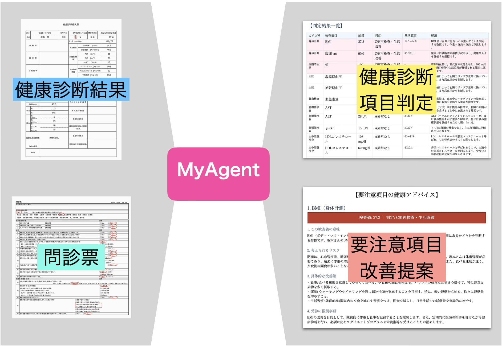
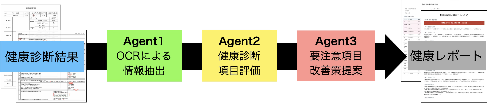
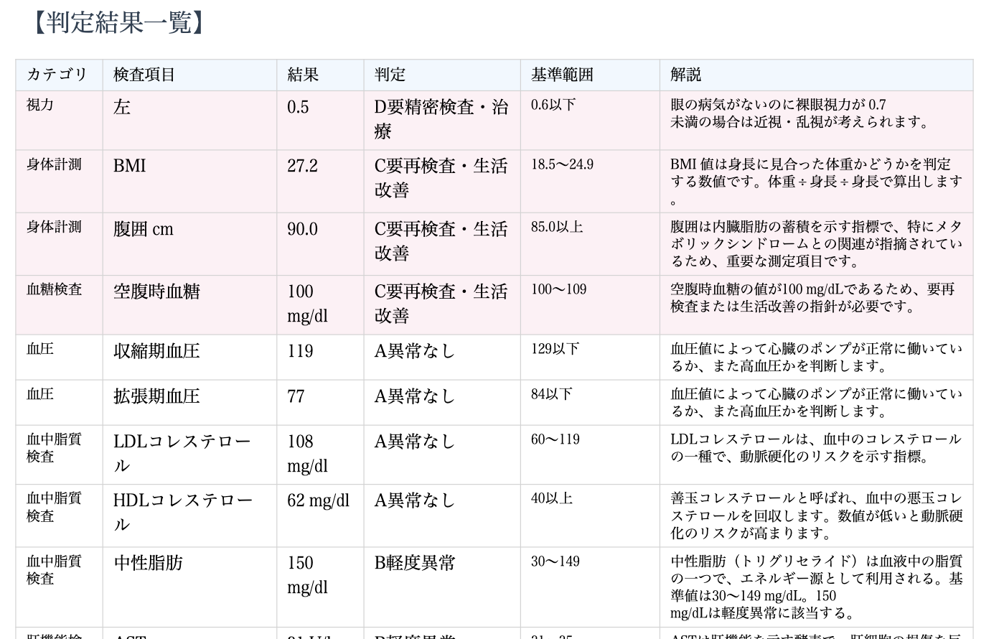
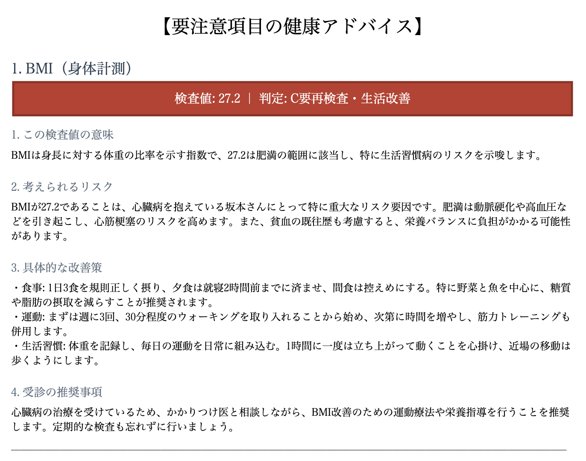
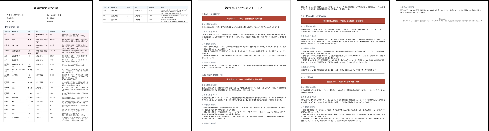

# 健康診断読解・改善提案生成AIエージェントシステム

## 1. 背景と課題

毎年の健康診断結果を受け取っても、多くの人は健康診断結果を活用することができていません。
- **専門用語の壁**: 検査項目の意味や基準値の解釈が難解である。
- **個別改善策の不足**: 画一的な判定に留まり、個々の生活習慣や既往歴に即したアドバイスが得られない。

これらの課題を解決するため、健康診断結果、生活習慣、既往歴のデータを統合的に読み解き、ユーザー一人ひとりに最適化されたパーソナライズ改善提案を生成するAIエージェントシステムを開発しました。

  

## 2. システム構成

本システムは、3つの自律的なエージェントが連携し、データの読み取りからレポート生成までを完全に自動化しています。

  

### Agent 1 — OCRによる情報抽出

GPT-4oのVision機能（マルチモーダル機能）を活用し、PDF形式の健康診断書からデータを抽出します。氏名、年齢、各検査値、問診票の回答内容を、欠損なくJSON形式で構造化出力します。

### Agent 2 — 健康診断項目評価

日本人間ドック・予防医療学会の判定基準をRAG（検索拡張生成）データベースとして参照します。性別・年齢を考慮し、各検査値を4段階（A：異常なし 〜 D：要精密検査・治療）で判定します。

  

> **RAGソースデータ:**
> [日本人間ドック学会 判定区分 2026年度版 (PDF)](https://www.ningen-dock.jp/ningendock/wp-content/uploads/2025/12/f5777368d3f9f1c60802063246d4c6ea.pdf)

### Agent 3 — 要注意項目改善提案

C・Dと判定された要注意項目に対し、専門的な健康情報データベースを利用してRAG検索を実施します。問診票から得られた生活習慣（食事・運動・睡眠等）と検査値を組み合わせ、以下の観点で個々のユーザーに最適化された改善策を提案します。

- 検査値の意味と示すリスク
- 具体的な生活習慣の改善アクション
- 受診の推奨事項

  

> **RAGソースデータ:**
>1. [国立保健医療科学院 特定健診・特定保健指導に関する教材](https://www.niph.go.jp/soshiki/jinzai/koroshoshiryo/kyozai/) 
>2. [大正製薬 健康診断の結果の見方](https://www.taisho-kenko.com/special/kenshin-guide/qa03/)
>3. [全国健康保険協会 健診結果の見方](https://www.kyoukaikenpo.or.jp/g4/cat410/sb4020/10kajyou/)

## 3. 精度向上と信頼性への工夫

医療情報を扱う性質上、ハルシネーション（AIによる誤回答）を徹底的に排除する仕組みを導入しています。

- **根拠の限定（Grounded RAG）**: プロンプトにより「提供された知識ベース（学会基準等）にない情報は一切使用しない」ことを強制。
- **厳格な構造化出力**: Pydantic等のスキーマ定義を用いた構造化出力を強制し、データの型不一致や情報の欠落を防止。
- **テンプレート照合によるOCR補正**: 事前に定義したJSONテンプレートを提示することで、OCR特有の読み取りミスや項目の位置ズレを抑制。

## 4. 技術スタック

本システムでは、高精度な分析とレポート生成を実現するために以下の技術を採用しています。

| カテゴリ | 技術・ライブラリ | 用途 |
|---|---|---|
| **LLM** | OpenAI GPT-4o   OpenAI GPT-4o-mini | OCR・データ抽出・画像解析   健診結果の評価・アドバイス生成 |
| **Framework** | LangChain | エージェント制御・RAG構築・ツール連携 |
| **Vector DB** | ChromaDB | 健康診断基準・医療情報の検索データベース |
| **Embedding** | intfloat/multilingual-e5-base | 日本語に特化したベクトル化モデル |

## 5. 出力結果
エージェントが生成した分析内容をまとめ、PDFレポートを出力します。**[健康診断レポート](エージェント生成レポート/健康診断生成レポート.pdf)**

  

## 6. 導入効果と今後の課題

### 導入効果
- **圧倒的なコストパフォーマンス**: 1回の分析にかかるAPIコストは**約0.04ドル（約6円）**程度です。
- **迅速なフィードバック**: 専門的な分析と個別アドバイスを即座に提供し、受診者の健康意識向上を支援します。

### 今後の課題 (Todo)
- **対話機能の実装**: ユーザーが結果について詳細を質問できるチャットボット機能の実装。
- **経年変化のトラッキング**: 過去数年分の診断データを統合し、数値の推移に基づいた中長期的な予測・提案機能の追加。

